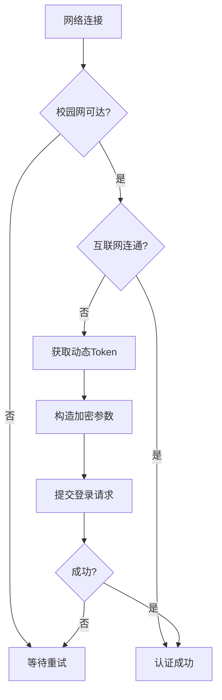

# CampusNetAutoAuth

[](LICENSE)
[](Version)

> 专为 BUCT network 设计的无感知认证工具，免去手动登录流程

## 背景

传统的校园网登录流程繁琐而费时，简化操作可节约学生时间。

我校校园网采用了独特认证体系，传统一键登录脚本无法适配。

本项目通过逆向工程校园网认证协议，实现了真正的后台无感知认证。

## 特性

- **静默运行** - 尽量减少视觉干扰，仅保留必要通知
- **状态检测** - 网络状态识别（互联网/校园内网）
- **加密兼容** - 基本复现校园网客户端JavaScript加密流程
- **重试机制** - 采用13×5s容错策略
- **即开即用** - 简单的单文件配置

## 使用说明

### 前置要求

- Windows 10/11 系统
- Python 3.7+ 环境
- 有效校园网账号

### 快速开始

1. 安装依赖
```bash
pip install requests win10toast
```
2. 配置参数
```python
# 修改以下参数
# 用户登录凭证
username = 'username'  # 请修改为自己的账号
password = 'password'  # 请修改为自己的密码
```
3. 运行程序
```bash
python login.pyw
```

### 计划任务配置

推荐通过Windows任务计划实现程序自启动


- 触发器：工作站解锁时（可设为只在指定网络连接可用时启动）
- 操作：启动程序（填入程序路径）
- 勾选"如果任务失败，按以下频率重新启动"（建议间隔1分钟）

## 实现原理

### 核心技术

- 令牌请求：向设定的 api 发送请求获取 Token
- 加密引擎：尽可能使用py还原校园网JS加密流程
- 状态检查：多重网络状态检测
- 容错机制：快速重试以避开错误

### 认证流程


## 局限性

- 网络环境 - 适用于直连校园网条件
- 场景限定 - 基于北化当前校园网认证系统设计
- 算法缺陷 - 符号兼容性有待优化，概率出现计算偏差

## 贡献
~~虽说可能不会再修改了，但~~
欢迎通过以下方式改进项目：
- 报告现存问题
- 优化加密算法
- 开发其他模块

## 作者

（排名不分先后）
- Chatgpt(4o/o3-mini)
项目分析理解
- Claude(3.7 Sonnet)
js加密算法还原
- DeepSeek(R1)
程序框架实现
- ()
信息整合 测试修改

**免责声明**：本项目仅用于技术研究，请遵守校园网使用规定。开发者不对其产生的后果负责。
